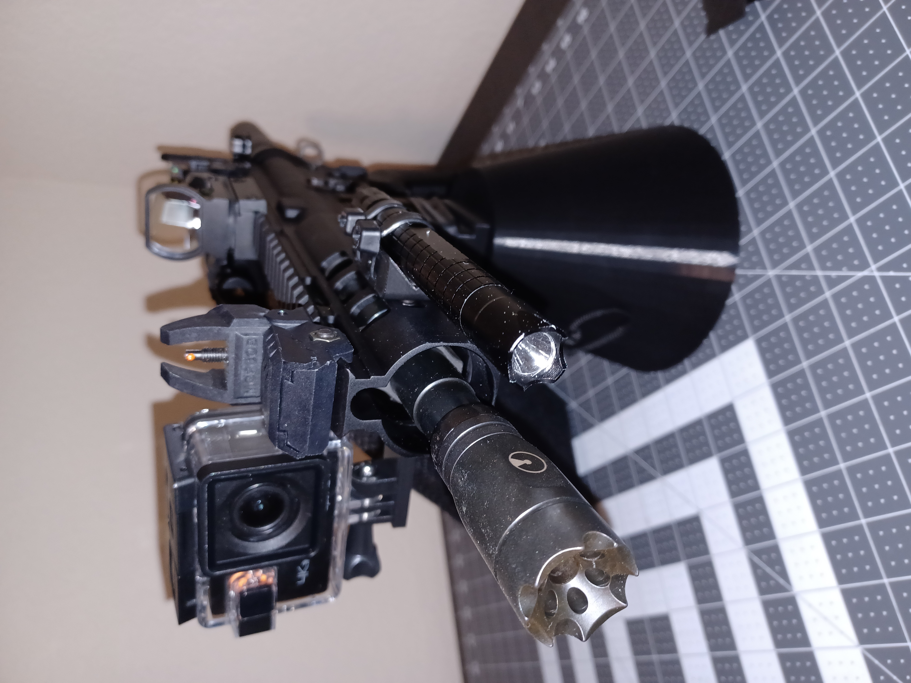
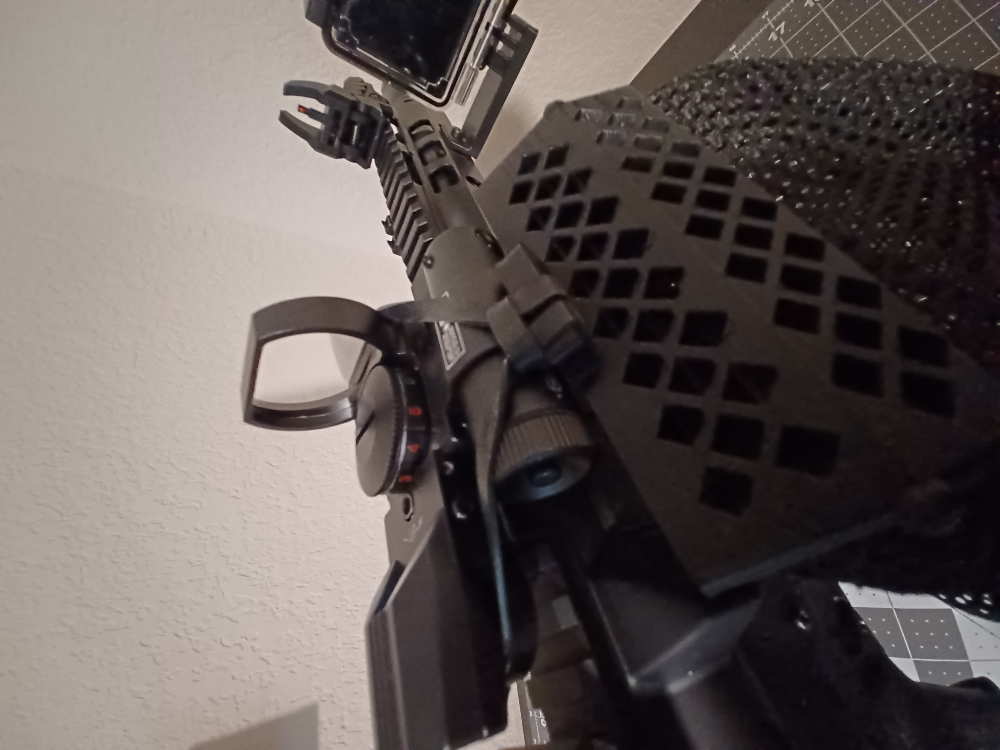

# Practical Blaster

Practical Blaster is a 3D printing project designed to help everyday people get the most out of their AR-15 style pistols.

## Recommended Items

* [Reflex Sight with Laser](https://www.amazon.com/gp/product/B09N6QKDCH/ref=ppx_yo_dt_b_asin_title_o01_s00?ie=UTF8&psc=1)
* [Backup Flip Up Sights](https://www.amazon.com/gp/product/B09YRRGB2M/ref=ppx_yo_dt_b_asin_title_o02_s00?ie=UTF8&psc=1)
* [Bore Sighter](https://www.amazon.com/gp/product/B0B9WTB2QN/ref=ppx_yo_dt_b_asin_title_o08_s00?ie=UTF8&psc=1)

## Printables

If you own a 3D printer you can print these parts; otherwise, [Craft Cloud](https://craftcloud3d.com/) can be used with the STL files in this directory to build the items below and have them shipped to your house.  Some items will require additional parts to be purchased.

> THERE IS NO WARRANTY WRITTEN OR IMPLIED.  USE AT YOUR OWN RISK.

---
### Brass Catcher
---

The _Brass Catcher_ is a hinged plate that is secured to the magazine housing face with a ranger band through the trigger guard and a hitch looped ranger band on top to go around the mounted optics.  The print in place hinge allows the operator to unwrap the top band to clean jams and review the breach without removing the device.

> Never add or remove the item from the weapon without making the weapon safe.

### Required Parts

* [Ranger Bands](https://www.amazon.com/dp/B0C2PM8YWV?psc=1&ref=ppx_yo2ov_dt_b_product_details)
* [Bags](https://www.amazon.com/gp/product/B09JYJJ6YM/ref=ppx_yo_dt_b_asin_title_o00_s00?ie=UTF8&psc=1)

---
### Chamber Flag (TPU)
---

_Chamber Flag_ is a mock 5.56 round that visually signals the chamber is empty.
The width of the flag is not enough to leave the spring under pressure os it won't have any negative effects on long term storage.

---
### Flash Light Mount
---

_Flash Light Mount_ is MLOK'ed to the side rail of your weapon.
Zip strips are used to secure the flash light on to the mount.
The beauty of this design is that it allows for any box store bought light to be used as a weapon mounted light.
Try to get flash lights with at least 1000 lumens and rear button for easy use.

Some tactical lights are hundreds of dollars which is fine when outfitting a single weapon.  It gets really expensive when you have handful.

### Required Parts

* [M5 T-Nut Metric Camming Screw](https://www.amazon.com/gp/product/B0B845WY3D/ref=ppx_yo_dt_b_asin_title_o05_s00?ie=UTF8&psc=1)
* [Zip Ties](https://www.amazon.com/gp/product/B08GYS2ZFN/ref=ppx_yo_dt_b_asin_title_o03_s00?ie=UTF8&psc=1)

---
### Handle Toolbox (TPU)
---

The Handle Toolbox fits with the empty space of a MOE (Magpul) handle.
A small toolbox holds 2 CR2032 for the red dot sight recommended above and 2 14250 batteries for the laser.  As a bonus the allen wrenches used to adjust the red dot sight and laser slide into the base of the toolbox.

The toolbox is tapered in a way that allows it to slide into the reliefs of the handles bottom plate.

### Required Parts

* [ER14250 batteries](https://www.amazon.com/gp/product/B077ST7HSC/ref=ppx_yo_dt_b_asin_title_o06_s00?ie=UTF8&psc=1)
* [CR2032 batteries](https://www.amazon.com/gp/product/B0855FD9P2/ref=ppx_yo_dt_b_asin_title_o06_s01?ie=UTF8&psc=1)

---
### Rail Camera Mount
---

_Go Pro_/_Ape Man_ camera mount for your MLOK accessories rail.
There is an indention for the acorn nut and a relief to allow the standard bolt and handle to work.  The back side of the MLOK mount face has two rail to prevent the post from twisting.

### Required Parts

* [M5 T-Nut Metric Camming Screw](https://www.amazon.com/gp/product/B0B845WY3D/ref=ppx_yo_dt_b_asin_title_o05_s00?ie=UTF8&psc=1)
* [Acorn Hex Cap Nuts](https://www.amazon.com/gp/product/B08JJ1WVQQ/ref=ppx_yo_dt_b_asin_title_o05_s00?ie=UTF8&psc=1)

---
### Stand
---

The _Stand_ is a part with a upper block that fits inside the magazine well of an AR-15 and locks in place with the magazine catch.  The lower body is a hollow cone that allows any flat surface to become a gunsmith bench.

> To remove the weapon, press the magazine release and lift up.

---
### Vice Holder
---

The _Vice Holder_ is a part with a upper block that fits inside the magazine well of an AR-15 and locks in place with the magazine catch.  The lower block is put into the jaws of a vice.

> To remove the weapon, press the magazine release and lift up.

---
### Wall Mount
---

The _Wall Mount_ is a part with a upper block that fits inside the magazine well of an AR-15 and locks in place with the magazine catch.  The lower body is a spacer with mollie holes for easy mounting to drywall.

> To remove the weapon, press the magazine release and lift up.

### Required Parts

* [Drywall Anchors](https://www.amazon.com/gp/product/B09WJYX5T7/ref=ppx_yo_dt_b_asin_title_o09_s00?ie=UTF8&psc=1)

